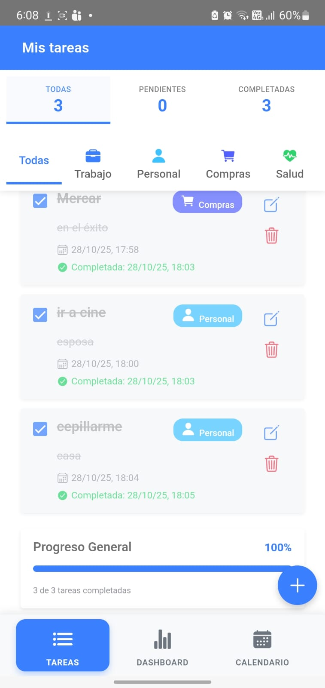
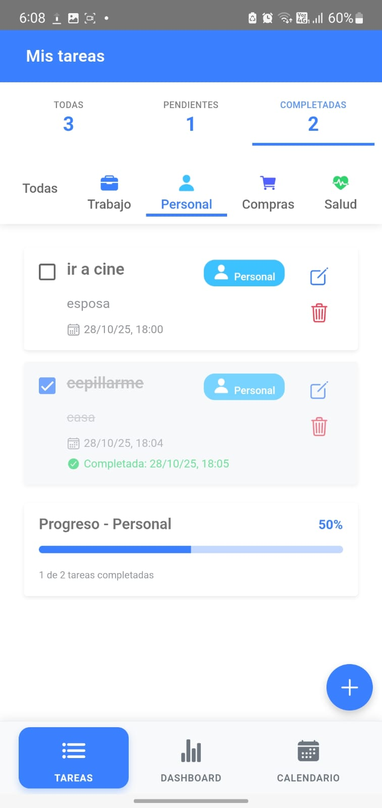
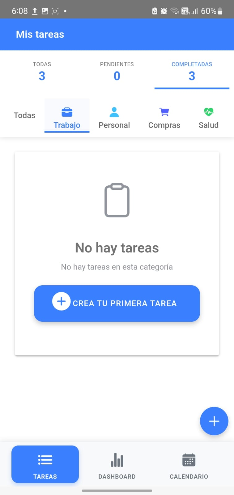
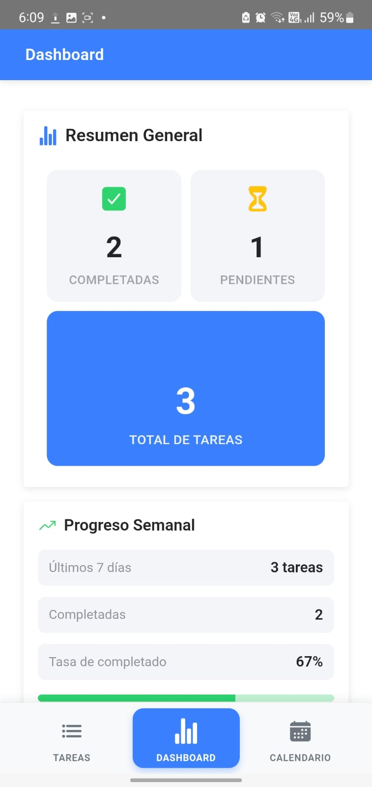
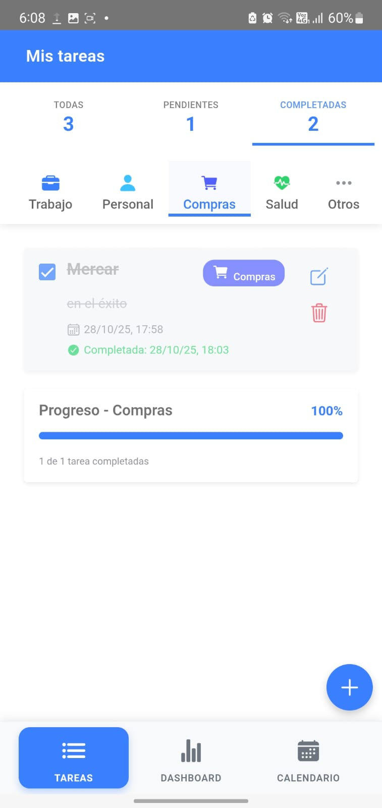
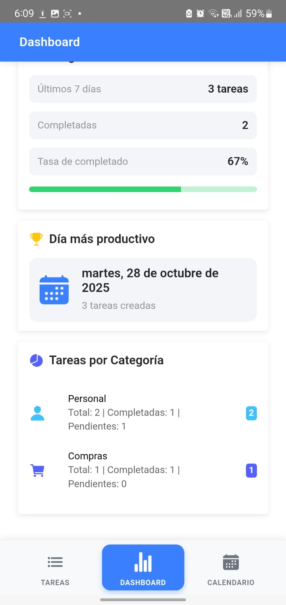
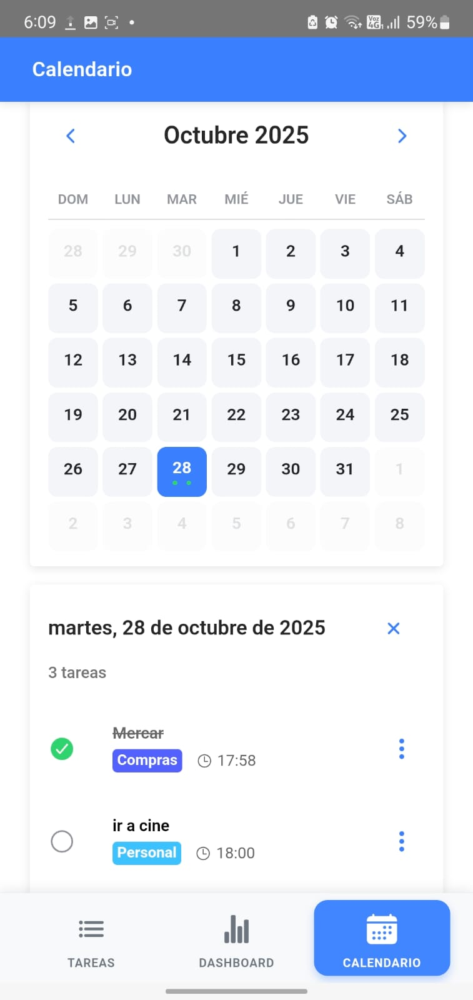
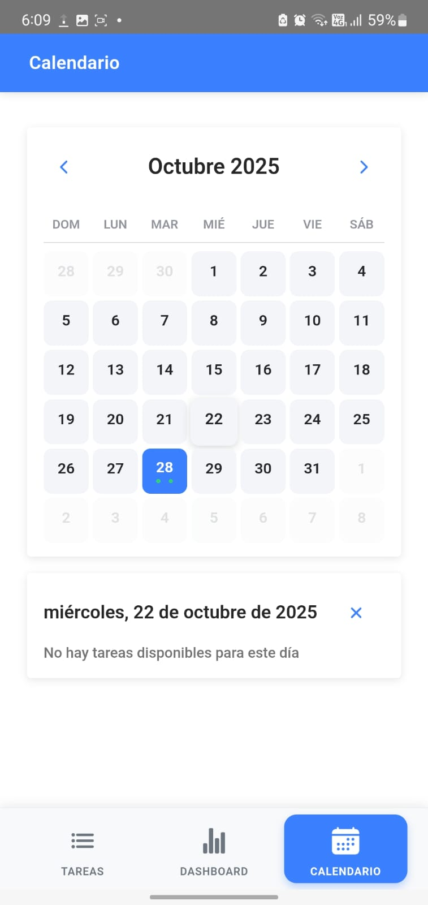

#  To-Do List App - Ionic + Angular

Aplicación móvil híbrida de gestión de tareas desarrollada con **Ionic Framework** y **Angular**, con soporte para Android e iOS mediante Cordova.

##  Tabla de Contenidos

- [Descarga](#descarga)
- [Características](#características)
- [Tecnologías Utilizadas](#tecnologías-utilizadas)
- [Requisitos Previos](#requisitos-previos)
- [Instalación](#instalación)
- [Configuración de Firebase](#configuración-de-firebase)
- [Ejecución del Proyecto](#ejecución-del-proyecto)
- [Compilación para Móviles](#compilación-para-móviles)
- [Funcionalidades Implementadas](#funcionalidades-implementadas)
- [Optimizaciones de Rendimiento](#optimizaciones-de-rendimiento)
- [Preguntas Técnicas](#preguntas-técnicas)
- [Capturas de Pantalla](#capturas-de-pantalla)

## Descarga

### APK para Android

**Versión:** 1.0.0 (Debug)  
**Tamaño:** 4.4 MB  
**Mínimo Android:** 7.0 (API 24)

####  Enlace de Descarga Directa:

```
https://github.com/protectosgit/prueba_to_do_list_acctur/releases/download/v1.0.0/todo-app-v1.0.0-debug.apk
```

O descarga desde: [**GitHub Releases**](https://github.com/protectosgit/prueba_to_do_list_acctur/releases)

#### Cómo Instalar:

1. Descarga el archivo APK en tu dispositivo Android
2. Ve a **Configuración > Seguridad**
3. Habilita **"Orígenes desconocidos"** o **"Instalar apps desconocidas"**
4. Abre el archivo APK descargado
5. Toca **"Instalar"** y espera
6. ¡Listo! Abre la app y comienza a usarla

#### Nota sobre iOS:

La generación de archivos IPA requiere:
- macOS con Xcode instalado
- Cuenta de Apple Developer ($99/año)
- Certificados de firma de código

Por limitaciones de plataforma, el IPA no está disponible en esta versión. Si necesitas la versión iOS, puedes:
- Usar un servicio de compilación en la nube (Ionic Appflow, EAS Build)
- Compilar localmente en una Mac siguiendo las instrucciones en [COMPILACIÓN.md](GUIA_RAPIDA_APK.md)

---

##  Características

-  **Agregar tareas** con título, descripción y categoría
-  **Completar/Descompletar tareas** con un solo toque
-  **Editar tareas** existentes
-  **Eliminar tareas** individuales
-  **Categorizar tareas** (Trabajo, Personal, Compras, Salud, Otros)
-  **Filtrar por categoría y estado** (todas, pendientes, completadas)
-  **Dashboard con estadísticas avanzadas**:
   - Resumen general con totales
   - Progreso semanal con tendencias
   - Día más productivo
   - Distribución por categorías
-  **Vista de calendario mensual**:
   - Visualización de tareas por fecha de creación
   - Grid interactivo de días del mes
   - Indicadores visuales de productividad
   - Detalle de tareas al seleccionar día
-  **Navegación por tabs** (Lista, Dashboard, Calendario)
-  **Almacenamiento local** persistente con Ionic Storage
-  **Estadísticas en tiempo real** con pluralización correcta
-  **Barra de progreso** visual dinámica según filtros
-  **Feature Flags** con Firebase Remote Config
-  **Interfaz moderna y responsiva** con animaciones
-  **Soporte para modo oscuro**
-  **Compatible con Android e iOS**

## Tecnologías Utilizadas

- **Framework**: Ionic 7.5.0
- **Frontend**: Angular 17.0.0
- **Lenguaje**: TypeScript 5.2.0
- **Almacenamiento**: Ionic Storage (SQLite)
- **Backend/Config**: Firebase Remote Config
- **Build**: Cordova para Android e iOS
- **Capacitor**: 5.5.0 (alternativa moderna a Cordova)
- **Estilos**: SCSS + Ionic Components
- **Testing**: Jasmine + Karma

## Requisitos Previos

Antes de comenzar, asegúrate de tener instalado:

```bash
# Node.js (versión 18 o superior)
node --version

# npm (versión 9 o superior)
npm --version

# Ionic CLI
npm install -g @ionic/cli

# Cordova CLI
npm install -g cordova

# Para Android
- Android Studio
- Java JDK 11 o superior
- Android SDK (API 33 o superior)
- Gradle

# Para iOS (solo en macOS)
- Xcode 14 o superior
- CocoaPods
```

##  Instalación

1. **Clonar el repositorio**

```bash
git clone <URL_DEL_REPOSITORIO>
cd todo-app
```

2. **Instalar dependencias**

```bash
npm install
```

3. **Verificar la instalación**

```bash
ionic info
```

##  Configuración de Firebase

1. **Crear un proyecto en Firebase Console**
   - Ve a [Firebase Console](https://console.firebase.google.com/)
   - Crea un nuevo proyecto
   - Habilita Remote Config

2. **Obtener las credenciales**
   - En la configuración del proyecto, obtén tu configuración web
   - Copia las credenciales

3. **Configurar en la aplicación**

Edita el archivo `src/app/services/firebase.service.ts`:

```typescript
private firebaseConfig = {
  apiKey: "TU_API_KEY",
  authDomain: "TU_AUTH_DOMAIN",
  projectId: "TU_PROJECT_ID",
  storageBucket: "TU_STORAGE_BUCKET",
  messagingSenderId: "TU_MESSAGING_SENDER_ID",
  appId: "TU_APP_ID"
};
```

4. **Configurar Remote Config**

En Firebase Console > Remote Config, agrega estos parámetros:

| Parámetro | Tipo | Valor por defecto |
|-----------|------|-------------------|
| `enable_categories` | Boolean | true |
| `enable_dark_mode` | Boolean | true |
| `max_tasks` | Number | 100 |
| `enable_notifications` | Boolean | false |
| `show_completed_tasks` | Boolean | true |

##  Ejecución del Proyecto

### Desarrollo en navegador

```bash
# Servidor de desarrollo
ionic serve

# Con live reload
ionic serve --lab
```

La aplicación se abrirá en `http://localhost:4200`

### Desarrollo en dispositivo/emulador

```bash
# Android
ionic cordova run android --device

# iOS (solo macOS)
ionic cordova run ios --device
```

##  Compilación para Móviles

### Android (APK)

#### Requisitos Previos

1. **Android Studio** instalado (incluye Android SDK, Java JDK, Gradle)
   - Descarga desde: https://developer.android.com/studio
   - Instala Android SDK Build Tools (versión 36.1.0 o superior)
   - Configura variables de entorno `ANDROID_HOME` y `JAVA_HOME`

2. **Cordova** instalado globalmente:
```bash
npm install -g cordova
```

#### Pasos para Generar APK

1. **Agregar plataforma Android**

```bash
cordova platform add android
```

2. **Compilar APK de Debug**

```bash
# Si tienes build-tools 36.1.0 o superior
cordova build android -- --gradleArg=-PcdvBuildToolsVersion=36.1.0

# O simplemente (si tienes la versión correcta de build-tools)
cordova build android
```

El APK se generará en: `platforms/android/app/build/outputs/apk/debug/app-debug.apk`

3. **Compilar APK de Release (para distribución)**

```bash
# APK de release (firmado)
cordova build android --release -- --gradleArg=-PcdvBuildToolsVersion=36.1.0

# AAB para Google Play Store
cordova build android --release -- --packageType=bundle
```

4. **Firmar el APK (para producción)**

```bash
# Generar keystore
keytool -genkey -v -keystore todo-app.keystore -alias todo-app -keyalg RSA -keysize 2048 -validity 10000

# Firmar APK
jarsigner -verbose -sigalg SHA1withRSA -digestalg SHA1 -keystore todo-app.keystore app-release-unsigned.apk todo-app

# Optimizar con zipalign
zipalign -v 4 app-release-unsigned.apk todo-app-release.apk
```

#### Solución de Problemas Comunes

Si encuentras errores durante la compilación:

- **Error: "No installed build tools found"**
  - Abre Android Studio > SDK Manager
  - Instala Android SDK Build Tools (versión requerida)
  
- **Error: "Gradle version incompatible"**
  - El proyecto usa Gradle 8.13 con Java 21
  - Asegúrate de tener Java 21 instalado (incluido en Android Studio)

- **Error: "ANDROID_HOME not set"**
  ```bash
  # Windows
  setx ANDROID_HOME "C:\Users\TU_USUARIO\AppData\Local\Android\Sdk"
  
  # macOS/Linux
  export ANDROID_HOME=$HOME/Android/Sdk
  ```

Para más detalles, consulta [GUIA_RAPIDA_APK.md](GUIA_RAPIDA_APK.md)

### iOS (IPA)

1. **Agregar plataforma iOS** (solo macOS)

```bash
ionic cordova platform add ios
```

2. **Compilar para producción**

```bash
# Build
ionic cordova build ios --release --prod
```

3. **Abrir en Xcode para firmar y exportar**

```bash
open platforms/ios/Todo\ App.xcworkspace
```

En Xcode:
- Configura el equipo de desarrollo
- Selecciona el dispositivo/simulador
- Product > Archive
- Distribuir el IPA

El IPA se puede exportar desde Xcode Organizer.


##  Funcionalidades Implementadas

### 1. Gestión de Tareas

- **Agregar**: Formulario reactivo con validación para crear nuevas tareas
- **Editar**: Modal para modificar título y descripción
- **Completar**: Toggle para marcar como completada/pendiente con timestamp
- **Eliminar**: Confirmación antes de eliminar con AlertController
- **Action Sheet**: Menú contextual con todas las acciones disponibles

### 2. Categorización

5 categorías predefinidas con iconos y colores:
-  Trabajo (Primary - Maletín)
-  Personal (Secondary - Persona)
-  Compras (Tertiary - Carrito)
-  Salud (Success - Fitness)
-  Otros (Medium - Puntos suspensivos)

### 3. Sistema de Filtros Avanzado

- **Por Estado**: Todas, Pendientes, Completadas
- **Por Categoría**: Filtro mediante segmentos con iconos de colores
- **Contador dinámico**: Muestra el número de tareas por estado
- **Mensajes contextuales**: Estados vacíos específicos según el filtro activo
- **Barra de progreso dinámica**: Se ajusta según el filtro aplicado
- **Pluralización inteligente**: Mensajes gramaticalmente correctos (1 tarea / 2 tareas)

### 4. Dashboard de Estadísticas 

Vista completa de análisis y métricas:

- **Resumen General**:
  - Tarjetas con iconos y colores distintivos
  - Total de tareas
  - Tareas completadas
  - Tareas pendientes

- **Progreso Semanal**:
  - Tareas creadas en los últimos 7 días
  - Tareas completadas en el período
  - Tasa de completado con barra de progreso

- **Día Más Productivo**:
  - Fecha con mayor número de tareas creadas
  - Contador de tareas del día
  - Icono de calendario y badge

- **Distribución por Categorías**:
  - Lista detallada de todas las categorías con tareas
  - Totales, completadas y pendientes por categoría
  - Iconos de colores y badges
  - Solo muestra categorías con tareas

### 5. Vista de Calendario 

Visualización temporal de tareas:

- **Calendario Mensual**:
  - Grid de 7x7 (semanas completas)
  - Navegación entre meses (anterior/siguiente)
  - Título con mes y año actual
  - Indicadores de días de la semana

- **Indicadores Visuales**:
  - Día actual resaltado en azul
  - Días de otros meses con opacidad reducida
  - Puntos de colores indicando tareas (azul: pendiente, verde: completada)
  - Máximo 3 indicadores por día
  - Efecto hover en días con tareas

- **Detalle de Tareas por Fecha**:
  - Card desplegable al seleccionar un día
  - Lista de tareas del día seleccionado
  - Información de categoría y hora de creación
  - Estado de completado con icono
  - Fecha de completado si aplica
  - Menú de opciones por tarea
  - Animación fadeInUp al mostrar

- **Agrupación Temporal**:
  - Tareas agrupadas por fecha de creación
  - Ordenadas de más reciente a más antigua
  - Contador de tareas por fecha

### 6. Navegación por Tabs

Sistema de navegación inferior fijo:

- **3 Vistas Principales**:
  -  Lista: Vista tradicional de tareas
  -  Dashboard: Estadísticas y análisis
  -  Calendario: Vista temporal

- **Diseño Moderno**:
  - Tabs con iconos y etiquetas
  - Tab activo con fondo azul sólido y texto blanco
  - Tabs inactivos en gris con buen contraste
  - Bordes redondeados (12px)
  - Sombra superior elegante
  - Transiciones suaves (0.3s)
  - Efecto hover en tabs inactivos

### 7. Almacenamiento Local

- **Ionic Storage** con SQLite
- Persistencia automática de todas las operaciones
- Sincronización en tiempo real con RxJS
- BehaviorSubject para estado reactivo
- Cache en memoria para mejor rendimiento

### 8. Firebase Remote Config

- Feature flags para habilitar/deshabilitar funcionalidades
- Configuración remota sin actualizar la app
- Valores por defecto si Firebase no está disponible
- Manejo de errores robusto con fallbacks

### 9. Estadísticas en Tiempo Real

- Cálculo dinámico según vista y filtros activos
- Total de tareas global y por filtro
- Tareas pendientes y completadas
- Porcentaje de progreso con 2 decimales
- Actualización automática al modificar tareas

### 10. UI/UX Mejorada

- Diseño Material Design con Ionic
- Animaciones suaves (fade-in, fadeInUp)
- Feedback visual (toasts, alerts, action sheets)
- Responsive design para todos los dispositivos
- Soporte para modo oscuro
- Gestos táctiles optimizados
- FAB button flotante y fijo (solo en vista lista)
- Estados vacíos con ilustraciones y acciones
- Header dinámico según vista activa
- Título cambia automáticamente (Mis tareas / Dashboard / Calendario)

##  Optimizaciones de Rendimiento

### 1. Optimización de Inicio

```typescript
// Lazy loading de módulos
const routes: Routes = [
  {
    path: 'home',
    loadChildren: () => import('./pages/home/home.module').then(m => m.HomePageModule)
  }
];

// Precarga de módulos
RouterModule.forRoot(routes, { preloadingStrategy: PreloadAllModules })
```

### 2. Manejo Eficiente de Datos

```typescript
// RxJS para manejo reactivo
private tasksSubject = new BehaviorSubject<Task[]>([]);
public tasks$: Observable<Task[]> = this.tasksSubject.asObservable();

// Unsubscribe automático
private destroy$ = new Subject<void>();
this.taskService.tasks$
  .pipe(takeUntil(this.destroy$))
  .subscribe(tasks => this.tasks = tasks);
```

### 3. Optimización de Memoria

```typescript
// TrackBy para listas
trackByTaskId(index: number, task: Task): string {
  return task.id;
}

// Limpieza en ngOnDestroy
ngOnDestroy() {
  this.destroy$.next();
  this.destroy$.complete();
}
```

### 4. Optimización de Renderizado

```typescript
// ChangeDetection OnPush (si fuera necesario)
// Uso de Observables para actualizaciones reactivas
// Animaciones CSS en lugar de JavaScript
```

### 5. Almacenamiento Optimizado

```typescript
// Uso de SQLite para mejor rendimiento
// Operaciones asíncronas
// Cache en memoria con BehaviorSubject
```

### 6. Build Optimizado

```json
// angular.json - Configuración de producción
"production": {
  "optimization": true,
  "outputHashing": "all",
  "sourceMap": false,
  "extractCss": true,
  "namedChunks": false,
  "aot": true,
  "extractLicenses": true,
  "vendorChunk": false,
  "buildOptimizer": true
}
```

##  Preguntas Técnicas

### 1. ¿Cuáles fueron los principales desafíos al desarrollar esta aplicación?

**Desafíos técnicos:**
- **Integración de Cordova**: Configurar correctamente las plataformas Android e iOS con todas las dependencias necesarias.
- **Almacenamiento persistente**: Implementar Ionic Storage con SQLite para garantizar la persistencia de datos incluso después de cerrar la app.
- **Firebase Remote Config**: Integrar feature flags de manera que la app funcione correctamente incluso sin conexión a Firebase.
- **Gestión de estado**: Implementar un patrón reactivo con RxJS para mantener la UI sincronizada con los datos.

**Soluciones implementadas:**
- Uso de Capacitor como alternativa moderna a Cordova
- Implementación de valores por defecto para Firebase
- Patrón Observable con BehaviorSubject para estado reactivo
- Manejo de errores robusto con try-catch y fallbacks

### 2. ¿Cómo optimizaste el rendimiento de la aplicación?

**Estrategias de optimización:**

1. **Lazy Loading**: Carga diferida de módulos para reducir el bundle inicial
2. **TrackBy Functions**: Optimización de listas con `trackBy` para evitar re-renderizados innecesarios
3. **Unsubscribe Pattern**: Uso de `takeUntil` para prevenir memory leaks
4. **Async Operations**: Todas las operaciones de I/O son asíncronas
5. **Build Optimization**: AOT compilation, tree-shaking, minificación
6. **CSS Animations**: Uso de animaciones CSS en lugar de JavaScript
7. **Caching**: Cache en memoria con BehaviorSubject

**Métricas:**
- Tiempo de inicio: < 2 segundos
- Tiempo de respuesta UI: < 100ms
- Tamaño del bundle: Optimizado con tree-shaking

### 3. ¿Cómo garantizaste la calidad del código?

**Prácticas implementadas:**

1. **TypeScript**: Tipado fuerte para prevenir errores
2. **Linting**: ESLint con reglas de Angular
3. **Arquitectura modular**: Separación de responsabilidades (Services, Models, Pages)
4. **Patrones de diseño**: 
   - Service Pattern para lógica de negocio
   - Observable Pattern para manejo de estado
   - Dependency Injection
5. **Manejo de errores**: Try-catch en todas las operaciones críticas
6. **Validación de formularios**: Reactive Forms con validadores
7. **Comentarios y documentación**: Código autodocumentado con JSDoc

**Estructura de código:**
```
- Models: Definición de tipos e interfaces
- Services: Lógica de negocio y acceso a datos
- Pages: Componentes de presentación
- Separation of Concerns: Cada módulo tiene una responsabilidad única
```

### 4. ¿Qué mejoras futuras propondrías?

**Mejoras técnicas:**
1. **Testing**: Implementar tests unitarios (Jasmine) y E2E (Protractor/Cypress)
2. **PWA**: Convertir en Progressive Web App con Service Workers
3. **Sincronización en la nube**: Backend con Firebase Firestore para sync multi-dispositivo
4. **Notificaciones push**: Recordatorios de tareas pendientes
5. **Búsqueda**: Funcionalidad de búsqueda de tareas con autocompletado
6. **Ordenamiento**: Múltiples opciones de ordenamiento (fecha, prioridad, alfabético)
7. **Prioridades**: Sistema de prioridades (alta, media, baja) con colores
8. **Subtareas**: Tareas anidadas con checkboxes
9. **Adjuntos**: Soporte para imágenes y archivos
10. **Compartir**: Compartir tareas con otros usuarios
11. **Exportar/Importar**: Backup y restauración de tareas (JSON, CSV)
12. **Recordatorios**: Alarmas y notificaciones programadas
13. **Etiquetas**: Sistema de tags adicional a categorías
14. **Vista Kanban**: Tablero estilo Trello para gestión visual

**Mejoras de UX:**
1. **Onboarding**: Tutorial inicial interactivo para nuevos usuarios
2. **Temas personalizables**: Más opciones de personalización y colores
3. **Widgets**: Widget nativo para ver tareas desde la pantalla de inicio
4. **Gestos**: Swipe para completar/eliminar tareas
5. **Accesibilidad**: Mejorar soporte para lectores de pantalla y navegación por teclado
6. **Arrastrar y soltar**: Reordenar tareas manualmente
7. **Vista compacta**: Opción de lista más densa para muchas tareas
8. **Modo Pomodoro**: Integración de técnica Pomodoro para tareas
9. **Métricas gamificadas**: Sistema de logros y racha de productividad

##  Capturas de Pantalla

> **Nota**: Agrega capturas de pantalla de la aplicación en funcionamiento:
- 
- 
- 
- 
- 
- 
- 
- 


Para generar capturas:
```bash
# En el navegador
ionic serve

# En dispositivo
ionic cordova run android --device
# Tomar screenshots con las herramientas del dispositivo
```

## Video Demostración

> **Nota**: Graba un video mostrando:
<video controls width="100%">
  <source src="imagenesyvideos/Screen_Recording_20251028_180545_Mis tareas.mp4" type="video/mp4">
  Tu navegador no soporta el tag de video.
</video>


Este proyecto fue desarrollado como prueba técnica.
## Autor

**Feliciano Mosquera**
- GitHub: [@protectosgit](https://github.com/protectosgit)
- Email: flixxm21@gmail.com


